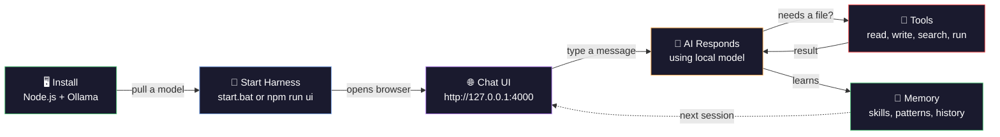
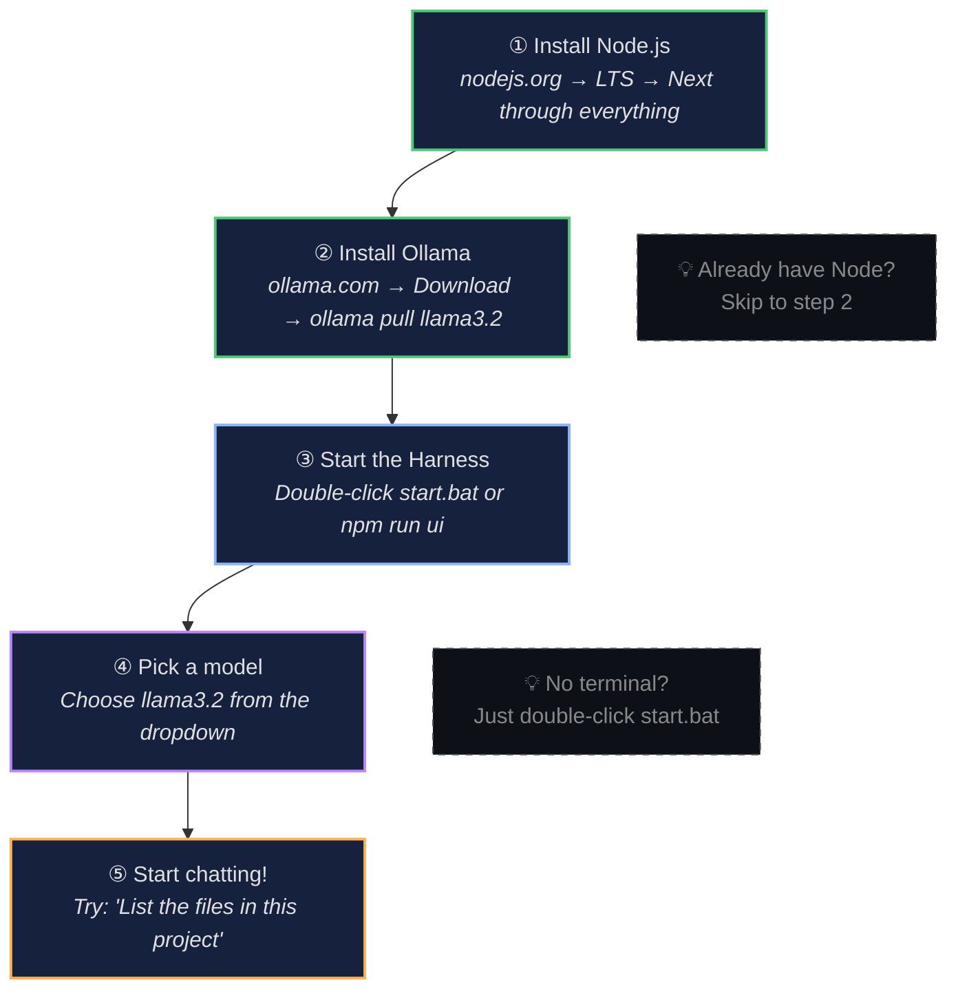

[](https://github.com/Bradliebs/ollama-agent-harness/releases/latest)
[](https://www.npmjs.com/package/ollama-agent-harness)

## What is this?

Ollama Agent Harness is a local-first agent runtime that wraps Ollama models with a browser UI, tool dispatch, permissions, session management, and learning infrastructure. Everything runs on your machine. No cloud accounts, no API keys beyond Ollama itself.

You chat with a model, it can call tools (read/write files, run bash, search the web, analyze images, transcribe audio, generate documents, send emails), and the harness manages permissions, context, and history.

**v0.3.9** adds a beginner-friendly welcome screen, multi-backend model routing, a Windows installer, and npm global install.

## How it works



### Your first 5 minutes



## Quick start

### Prerequisites

* [Node.js](https://nodejs.org/) 18+
* [Ollama](https://ollama.com/) running locally with at least one model pulled (e.g. `ollama pull llama3.2`)

### Option A — Windows installer (easiest)

Download **Harness-Setup.exe** from the [latest release](https://github.com/Bradliebs/ollama-agent-harness/releases/latest), run it, and double-click the desktop shortcut. The installer checks for Node.js and Ollama automatically.

### Option B — npm global install

```powershell
npm install -g ollama-agent-harness
harness
```

### Option C — Double-click (from source)

1. Clone this repo
2. Double-click `start.bat` (Windows) or run `./start.sh` (Mac/Linux)
3. Open **http://127.0.0.1:4000** in your browser

### Option D — Terminal (from source)

```powershell
npm install
npm run ui
```

Open **http://127.0.0.1:4000** in your browser. That is the full UI — start chatting in the main panel.

### CLI mode

```powershell
npm run start -- -p "Summarize the project" --model llama3.2
```

Run `npm run start -- --help` for all CLI flags including `--mode`, `--max-turns`, `--validate-output`, and helper model routing.

### Validation

```powershell
npm run typecheck
npm test -- --runInBand
```

With the UI server running, smoke-test the browser:

```powershell
npm run smoke:ui -- http://127.0.0.1:4000/
```

Smoke-test the Mycelium API route-inspection surface with a temporary seeded
graph:

```powershell
npm run build
npm run smoke:mycelium
```

Tests and smoke scripts that need `.harness/**` state should create the fixture
inside the test or script and restore the prior state before exiting. Do not
depend on ignored local files already existing in a developer checkout.

For local timeout checks against a real Ollama model, run the optional
long-prompt smoke after building:

```powershell
npm run build
npm run smoke:long-prompt
```

Override the model, host, prompt size, timeout, or context window with
`HARNESS_LONG_PROMPT_MODEL`, `OLLAMA_HOST`, `HARNESS_LONG_PROMPT_LINES`,
`HARNESS_LONG_PROMPT_TIMEOUT_MS`, and `HARNESS_LONG_PROMPT_NUM_CTX`.

## Operating services

Agentic Service Mode handles ongoing service requests before model selection.
Requests such as reminders, bullet journals, and daily site checks create local
operating services under `.harness/services/` instead of asking the model to
build an app or write task files.

See [Operating Services](docs/OPERATING-SERVICES.md) for the storage contract,
deterministic commands, scheduler behavior, Discovery detail flow, and
model-agnostic routing rules.

## Autonomy mode

Run the harness against itself, draining `IMPLEMENTATION_PLAN.md` task by
task, with no human in the loop:

```powershell
$env:HARNESS_MODEL = "kimi-k2.5:cloud"   # see model matrix below
$env:FORGE_MAX_ITERATIONS = "10"
npm run autonomy            # full run
npm run autonomy:dry        # preview one iteration without spending tokens
npm run autonomy:stop       # graceful stop signal
npm run autonomy:reset      # clear .forge-state.json + .forge-stop
```

Tasks in `IMPLEMENTATION_PLAN.md` may declare anchors (read-only file
context the model gets inline) and a target (the file to edit):

```markdown
- [ ] verify-permissions-deny-first — Add a focused jest test under `src/permissions/`...
  - anchor: src/permissions/engine.ts
  - anchor: src/permissions/engine.test.ts
  - target: src/permissions/engine.test.ts
```

Live progress: `.forge-state.json` (one-shot), `.forge-history.jsonl`
(append-only per iteration), `.forge-run.log` (mirrored console output),
`.forge-debug.jsonl` (raw model exchanges, only with `HARNESS_DEBUG_LOG`
set or `npm run autonomy:debug`). The web UI surfaces the autonomy HUD
in the topbar with a click-through log tail modal.

### Model capability matrix

What we measured running real autonomy iterations on this codebase
(May 2026). "Writes correct code" means the model picked the task,
called `file_write`/`file_edit`, and produced output that passed
`npm run typecheck`.

| Model | Backend | Tool calls | Writes correct code | Notes |
|---|---|---|---|---|
| `kimi-k2.5:cloud` | ollama (Pro) | ✅ native | ✅ **yes** with anchors | First model to land an autonomy commit end-to-end. Recommended. |
| `gpt-oss:120b-cloud` | ollama | ✅ native | ⚠️ writes code, often wrong code | Explores well but may scaffold generic structure instead of doing the task. |
| `gpt-oss:20b-cloud` | ollama | ✅ native | ❓ untested at length | Same family as 120b, ~6× faster. |
| `qwen3-coder:480b-cloud` | ollama | ❌ chats | ❌ no | Refuses to use tools on this codebase. |
| `deepseek-v3.1:671b-cloud` | ollama | ❓ untested | ❓ untested |  |
| `qwen2.5-coder:14b` | ollama (local, ~9GB) | ✅ but wrong tools | ❌ no | Loops on `reflect`/`promote_pattern`, ignores tool whitelist. |
| `qwen2.5-coder:7b` | ollama (local, ~4GB) | ⚠️ JSON-as-text | ❌ no | Mitigated by inline tool-call parser; still picks wrong tools. |
| `gemma4:e4b`, `gemma4:26b` | ollama (local) | ❌ chats | ❌ no | Conversational only. |
| `llama3.1-8b` | cerebras | ✅ but wrong tools | ❌ no | Hallucinates `recall`/`remember`; only Cerebras free model accessible. |
| `gpt-oss-120b` | cerebras | ❌ 404 on free | ❌ no | Listed in `/v1/models` but free tier returns 404. |
| `qwen-3-235b-a22b-instruct-2507` | cerebras | ⚠️ rate-limited | ❓ untested | Free RPM is shared at the tier level; usually 429s. |
| `gpt-4.1`, `gpt-4.1-mini`, `o3-mini` | github | ❓ untested | ❓ untested | High expected value; needs `GITHUB_TOKEN` with Models scope. 50-150 RPD free. |
| `kimi-k2-instruct` | groq | ❓ untested | ❓ untested | Same Kimi lineage; free, 14,400 RPD. |

Backends are configured via `HARNESS_BACKEND` (or `--backend` flag) plus
the appropriate `*_API_KEY` env var. `harness doctor` lists every
configured backend and reports whether its key is set.

### Recommended models for tool use

Not every model can call tools. These are the ones that work with the harness.

#### Local Ollama — best picks

| Model | Size | Best role | Pull command |
|---|---|---|---|
| `qwen3:8b` | ~5 GB | Main local agent | `ollama pull qwen3:8b` |
| `qwen3:14b` | ~9 GB | Better planner | `ollama pull qwen3:14b` |
| `qwen2.5-coder:7b` | ~4 GB | Coding agent | `ollama pull qwen2.5-coder:7b` |
| `qwen2.5-coder:14b` | ~9 GB | Stronger coder | `ollama pull qwen2.5-coder:14b` |
| `llama3.1:8b` | ~5 GB | Stable fallback | `ollama pull llama3.1:8b` |
| `phi4-mini` | ~2 GB | Fast router | `ollama pull phi4-mini` |
| `devstral` | ~15 GB | Coding agent | `ollama pull devstral` |
| `mistral-small3.2` | ~15 GB | Function calling | `ollama pull mistral-small3.2` |
| `granite4.1:8b` | ~5 GB | Structured tasks | `ollama pull granite4.1:8b` |
| `gemma4:26b` | ~16 GB | Heavy reasoning | `ollama pull gemma4:26b` |

Quick start set (fits most GPUs):

```powershell
ollama pull qwen3:8b
ollama pull qwen2.5-coder:7b
ollama pull phi4-mini
ollama pull llama3.1:8b
```

#### Mistral API (free tier)

| Model ID | Best role |
|---|---|
| `mistral-small-latest` | General agent — best starting point |
| `devstral-small-latest` | Coding agent — test first |
| `codestral-latest` | Code generation specialist |
| `ministral-8b-latest` | Cheap router |
| `magistral-small-latest` | Reasoning/review |
| `mistral-medium-latest` | Better planner (rate-limited) |
| `mistral-large-latest` | Highest quality (use sparingly) |

Configure with `MISTRAL_API_KEY` and `--backend mistral`.

#### Recommended stack

```text
Planner:   qwen3:8b (local) or mistral-small-latest (API)
Coder:     qwen2.5-coder:7b (local) or devstral-small-latest (API)
Router:    phi4-mini (local) or ministral-8b-latest (API)
Reviewer:  llama3.1:8b (local) or magistral-small-latest (API)
```

## UI tabs

The browser UI has 13 tabs in the left sidebar:

| Tab | What it does |
|-----|-------------|
| 💬 **Chats** | Chat history, new/export sessions |
| 📁 **Files** | Browse and read project files |
| ⚡ **Skills** | Runtime and repo skill libraries, skill curator, install/scaffold actions |
| 🧠 **Memory** | Agent memory entries per session |
| 🏛 **Palace** | Memory palace browser (semantic memory) |
| 🔮 **Discover** | Discovered patterns and learning candidates |
| 📈 **Learning** | Eval trace runs, output validation trends, learning datasets |
| 📦 **Snaps** | Skill and memory snapshots for backup/restore |
| 🔎 **RAG** | Local vector index over chosen files with search and rebuild |
| 🛠 **Tools** | Tool registry with risk badges, permissions, kill switch, capability grants, shell presets |
| 📜 **Runs** | Session list, automation jobs, run history, scheduler status |
| ⚙ **Flows** | Declarative tool-call workflows (YAML/JSON under `.harness/workflows/`) |
| 🍄 **Mycelium** | Adaptive context routing network — nodes, edges, episodes |

The right side has a **Settings** panel for Ollama host, generation parameters, model routing, media tools, output validation, and safety mode. Settings are saved to `.harness/settings.json`.

## Key concepts

### Tools

Built-in tools include `file_read`, `file_write`, `file_edit`, `bash`, `list_files`, `grep`, `web_fetch`, `web_search`, `web_read`, `image_analyze`, `audio_transcribe`, `document_export`, `email_send`, `email_draft`, `create_skill`, `install_skill`, `desktop_screenshot`, `browser_bookmarks`, `browser_navigate`, `browser_click`, `browser_fill`, `browser_read`, `browser_screenshot`, `browser_close`, `calendar_read`, `calendar_write`, `telegram_notify`, and more. Each tool has a risk level (low/medium/high) and can be individually disabled from the Tools tab.

Browser tools (`browser_navigate`, `browser_click`, `browser_fill`) are disabled by default and require a capability grant — they interact with live websites via Playwright.

### Document generation

The `document_export` tool creates CSV, Excel (.xlsx), Word (.docx), and PDF files directly from chat. Numbers, percentages, and currency values are auto-formatted in Excel. Tables are supported in Word and PDF. All documents are redirected to the configured Agent Files directory.

### Email

The `email_send` tool sends real emails via SMTP with optional file attachments. Configure SMTP credentials in Settings → API Keys (`HARNESS_SMTP_HOST`, `HARNESS_SMTP_USER`, `HARNESS_SMTP_PASS`). For Gmail, use an [App Password](https://myaccount.google.com/apppasswords). Sent emails are archived under `.harness/email/sent/`.

### Telegram bot

Talk to Oracle from your phone via Telegram. Create a bot with [@BotFather](https://t.me/BotFather), paste the token in Settings → Telegram Bot, and start chatting. Supports:

* Text messages — Oracle responds via the chat API
* Photos — analyzed with the vision model
* Files — PDF, CSV, Excel, images auto-detected and processed
* Voice notes — transcribed and responded to
* `/task` — add tasks to the autonomy plan
* `/schedule every 6h Check prices` — create recurring automation jobs
* `/status` — check readiness scores
* Inline progress — see tool calls happening in real time
* Notifications — automation job results pushed to your chat

### Discord bot

Talk to the harness from any Discord server. Create a bot at the [Discord Developer Portal](https://discord.com/developers/applications), enable Message Content Intent, and set `HARNESS_DISCORD_BOT_TOKEN`. Optionally restrict to specific channels with `HARNESS_DISCORD_ALLOWED_CHANNEL_IDS`.

### Mission Control

The welcome screen shows a Mission Control dashboard with:

* Readiness scores for Chat, Coding, Research, Automation, and Full Autonomy
* Autonomy Run Builder with task creation form and one-click start
* Document Studio for generating briefs, reports, and specs
* Job templates for daily digest, hotel monitor, weekly report, and email reminder

### Chat commands

* `/task Create a report` — add a task to the autonomy plan
* `/schedule every 24h Send daily summary` — create a recurring automation job
* Type `/` to see all available slash commands

### Permissions

Three permission modes control tool execution:

* **default** — prompts for confirmation on medium/high-risk tool calls
* **acceptEdits** — auto-approves file edits, prompts for everything else
* **dontAsk** — auto-approves everything (use with caution)

The **kill switch** (Tools tab or Ctrl+Shift+K) blocks all tool calls until released.

### Capability grants

High-risk surfaces (shell execution, background jobs, self-modifying code) require explicit time-limited grants with required controls before they can be used. Create and revoke grants from the Tools tab. All grant lifecycle events (created, revoked, expired) are recorded in `.harness/capabilities/audit.jsonl`.

Capabilities are classified by posture:

* **available** — usable without a grant
* **gated** — requires an explicit grant with required controls
* **design-only** — connector not yet implemented
* **blocked** — denied by default, no grant path

### Shell command allowlist

When a background automation job needs to run a shell command, it must have active `arbitrary-shell` and `background-autonomous-jobs` grants AND match a command allowlist preset. Four presets are built in:

* **git-read-status** — `git status`, `git diff --stat`, `git log --oneline`
* **file-discovery** — `dir`, `rg --files`, `Get-ChildItem` (rejects `..` path traversal)
* **tool-version** — `node --version`, `npm --version`, `git --version`
* **project-validation** — `npm run typecheck`, `npm run build`, `npm run smoke:ui`

Commands that do not match a preset are denied even with active grants.

### Skills

Skills are structured prompts that teach the model domain-specific tasks. They live in `.harness/skills/` (runtime) and `.github/skills/` (repo). The **Skill Curator** optionally archives stale skills and proposes merges.

### Sessions and context

Chat sessions persist under `.harness/sessions/`. Context continuity detects model context length and manages conversation history. Sessions can be forked and resumed.

### Output validation

Optional deterministic checks on the model's final answer. Built-in profiles: `oracle-prime`, `factual-answer`, `coding-answer`, `tool-result-summary`. Custom profiles can be authored from Settings or `.harness/output-validation-profiles.json`. See [VALIDATION-PROFILES.md](docs/VALIDATION-PROFILES.md) for the full reference.

### Media tools

* **Image analysis** — configure a vision model in Settings or with `HARNESS_VISION_MODEL`
* **Audio transcription** — configure a transcription command in Settings or with `HARNESS_AUDIO_TRANSCRIBE_COMMAND`

### Agent identity

Give your agent a name, avatar emoji, and personality. Presets include professional, friendly, concise, mentor, creative, and pirate. Save multiple profiles and switch between them. The agent name appears in chat bubbles, the topbar, and session history.

### Full Autonomy mode

Click **⚡ Full Autonomy** in Settings to set `dontAsk` mode and enable all tools in one click. All 9 gated capabilities auto-grant for 8 hours. Kill switch (Ctrl+Shift+K) remains the emergency stop.

### Mycelium context router

An adaptive graph system that learns which combinations of tools, skills, and memories work best for different queries. The network reinforces successful routes and decays unused ones. View the graph in the 🍄 Mycelium tab.

### Automation

Schedule recurring jobs with optional shell commands. Create, edit, toggle, and delete jobs from the Runs tab. The automation scheduler runs due jobs when the system is idle, respecting kill switch and capability grants. Run history with output viewing is available in the Runs tab.

## Project structure

```text
src/            TypeScript source (core, tools, web server, permissions, automation, learning)
ui/             Browser UI (index.html, app.js, chatHistory.js)
docs/           Additional guides (MODEL-PRESETS, VALIDATION-PROFILES, GETTING-STARTED)
cookbook/        Code examples and integration guides
scripts/        Build, smoke, and release scripts
.harness/       Runtime state (settings, sessions, skills, memory, automations) — gitignored
```

## Storage

All runtime state goes under `.harness/` in your project directory:

| Path | Contents |
|------|----------|
| `.harness/settings.json` | Server and UI configuration |
| `.harness/sessions/` | Chat session transcripts |
| `.harness/skills/` | Runtime skill definitions |
| `.harness/memory/` | Agent memory entries |
| `.harness/capabilities/audit.jsonl` | Grant and automation audit log |
| `.harness/automations/` | Scheduled job definitions and output |
| `.harness/curator/` | Skill curator log and merge proposals |
| `.harness/workflows/` | Declarative workflow definitions |
| `.harness/mycelium/` | Adaptive routing graph |
| `.harness/desktop/` | Desktop screenshots |
| `.harness/email/drafts/` | Email draft files |
| `.harness/email/sent/` | Sent email archive |
| `.harness/documents/` | Generated documents (Markdown, HTML, PDF, DOCX) |
| `.harness/evidence/` | Run evidence cards (automation, autonomy) |
| `.harness/telegram-chat-ids.json` | Telegram notification recipients |

## More information

* **[START-HERE.md](START-HERE.md)** — complete beginner guide (install Node.js, install Ollama, first chat)
* **[CHANGELOG.md](CHANGELOG.md)** — release notes for every version
* [Model presets guide](docs/MODEL-PRESETS.md) — beginner-friendly model recommendations
* [Validation profiles](docs/VALIDATION-PROFILES.md) — output validation reference
* [Mycelium router](docs/MYCELIUM-ROUTER.md) — adaptive context routing reference
* [20/10 Roadmap](docs/TWENTY-OUT-OF-TEN-ROADMAP.md) — product roadmap
* [GitHub Releases](https://github.com/Bradliebs/ollama-agent-harness/releases/latest) — download the latest release
