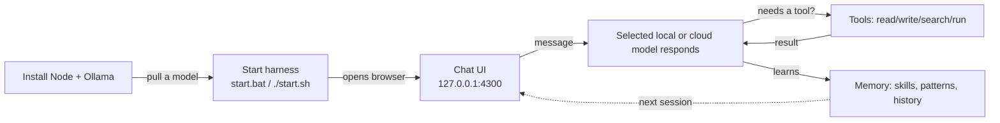

## What it is

A **local-first agentic runtime** (TypeScript / Node.js, package version **v0.6.5**
with unreleased development changes) with a browser UI, tool dispatch,
permissions, persistence and self-improvement infrastructure. Local inference
needs no cloud account. Explicitly selected cloud models, remote Ollama hosts
and network tools transmit data outside the machine and may incur charges.
Tools run under the local user's permissions; cloud inference does not move
filesystem execution to the provider.

The current validation checkpoint is [Modernization Status](MODERNIZATION-STATUS.md).
It separates offline checks, live cloud workflow evidence and outstanding release gates.

The architecture deliberately borrows patterns from the Claude Code paper (*"Dive into Claude Code: The Design Space of Today's and Future AI Agent Systems"*), which is the design north star recorded in [FORGE.md](../FORGE.md).

## Guiding design constraints

These show up everywhere in the code:

- **Local-first**: workspace state normally lives under the resolved project directory's `.harness/`; `HARNESS_PROJECT_DIR` can separate it from the installation. Background ownership and maintenance markers remain installation-local.
- **Shared client contract**: Ollama is the default; a chat-client factory also abstracts cloud backends. Provider adapters and model routing still have provider-specific behavior.
- **Explicit opt-ins**: experimental autonomy features keep their documented default-off gates. Runtime fixes and minimum-version requirements are not universally feature-flagged.
- **Evidence-driven validation**: the 2026-09-14 full run passed 3,759 tests across 316 suites, with one skipped and exit code 0. Test expectations must also match stated task contracts; passing fixtures alone do not establish live-model reliability.
- **Minimal scaffolding / deny-first safety / append-only state** — a simple while-loop agent core, deny rules override allow rules, and JSONL transcripts that compact by appending rather than deleting.

## How it runs

Three user surfaces: the **web chat UI**, a **terminal client (TUI)**, and a **CLI** (`harness ...`).

## Subsystems (`src/`)

| Area | Responsibility |
|---|---|
| **core/** | The heart: `queryLoop` drives the LLM→tool→LLM cycle; chat-client factory + backend adapters; auto-fallback on rate-limit/5xx; output validation; structured-output JSON-schema enforcement; tracing; rate limiting. |
| **agents/** | Sub-agent orchestration with isolated context windows and summary-only returns; custom agent loader (`.harness/agents/*.md`); small/default/strong helper-model routing. |
| **tools/** | 30+ built-in tools — filesystem, web read/search, image analyze, PDF read, audio transcribe, docker exec, task/agent/squad tools, memory tools. Path resolution corrals bare-filename writes into `agent-outputs/`. |
| **permissions/** | Three-layer security: declarative engine allowlist per mode, opt-in capability registry (with kill-switch + audit), and a JSONL audit log that injects failure signals into the prompt. |
| **persistence/** | Sessions, an append-only event store, a promise ledger (tracked obligations), and cross-session continuity. |
| **services/** | The largest subsystem (~22 modules): self-learning heartbeat, trigger scheduler, concierge intent router, multi-agent squads, identity (SOUL/USER), semantic memory intelligence, per-model profiles, capability registry, artifact catalog. |
| **web/** | Express app with extracted route modules, REST and SSE streaming chat, and WebSocket fanout, serving the static SPA from `ui/`. |
| **mycelium/** | A long-term, reward-weighted routing graph that classifies intent and routes through safety/agent/verifier/workflow nodes, updating edge weights with reward. |
| **learning/ + eval/** | Extracts skill candidates from finished sessions, gates them through a multiplicative safety promotion gate, and runs adversarial probes (prompt-injection, secret-exfil, tool-misuse, safety-refusal) via a simulator. |
| **observability/** | Prometheus `/metrics`, OpenInference/OTLP span export. |
| **setup/** | `doctor` health probes and `doctor --fix` auto-remediation. |
| **integrations/** | Self-contained adapters for Discord, Slack, Telegram, Teams, GitHub PR — none required for the core loop. |
| **nervous/, curator/, jarvis/, automation/, goal/** | Reflex heuristics, memory curation, voice (Jarvis/Whisper), background scheduling, and the `/goal` natural-language expander. |

## State on disk (`.harness/`)

Sessions, secrets (gitignored connector tokens + API keys), uploads, agent-outputs, custom agents, squads, identity, capabilities, promises, tasks, triggers, the audit log, the event store, heartbeat/concierge logs (auto-pruned), the mycelium graph, eval traces, and per-model profiles.

## Build trajectory

The CHANGELOG traces an active path from v0.4.x → v0.6.4:

- **v0.4.0–0.4.2** — observability (Prometheus + OTLP), per-model profiles, doctor auto-fix, attachment context injection so the model rarely needs a `file_read` round-trip.
- **v0.6.0–0.6.4** — the **Apex** family of autonomous end-to-end experiences (the `/goal` expander, PDF→wiki blueprint, Kanban→autonomy bridge, competitor-research renderer, personal memory wiki, daily morning-priority prompt). Apex was renamed from "Hermes" to avoid trademark concerns — strings only, no behavioural change.
- **v0.6.4 specifically** — **ccmem semantic memory**: a bundled FastAPI sidecar (`ccmem/service.py`) on port 8765 implementing the Tyukin & Gorban concept-cell scheme. Every `remember` call now dual-writes to a semantic memory bank and recalls related memories by *meaning* rather than keyword. It is best-effort — if the service is down, the harness behaves identically. Plus startup hardening (BOM-corrupted path fix, better `npm install` errors) and operate-mode routing fixes.

## Supporting infrastructure

Beyond the runtime, the repo carries a mature release/ops apparatus: a large `scripts/` directory of smoke tests (UI, transport, mycelium, telegram, voice, installer, release) and release tooling (provenance generation, version bumping, changelog verification, release-readiness checks); a Windows NSIS installer; a `cookbook/` of reference recipes; `docs/` operator references; and `.github/skills/` encoding the project's own conventions (harness-conventions, code-review, testing, plan-executor).

## In one sentence

It is a **fully local, model-agnostic AI agent platform** — chat UI + tools + permissions + persistent memory + self-learning + observability — engineered around Claude-Code-paper patterns, that has matured from a tool-using chat loop into an autonomous-experience platform with semantic memory, all running on your own hardware.

## Related references

- [README.md](../README.md) — quick start and feature tour
- [START-HERE.md](../START-HERE.md) — complete beginner guide
- [FORGE.md](../FORGE.md) — architecture patterns and configuration
- [docs/SYSTEM-BREAKDOWN.md](SYSTEM-BREAKDOWN.md) — exhaustive single-page system reference
- [CHANGELOG.md](../CHANGELOG.md) — full release history
